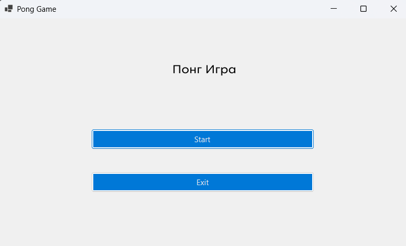
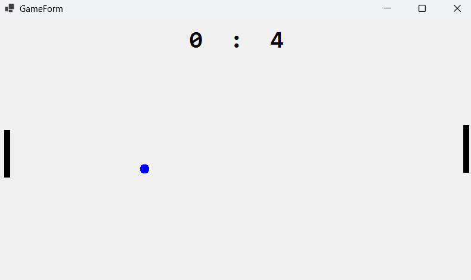

# Pong Игра

**Автор:** Симеон Маркоски (191073) 
**Датум:** Мај 2025  

---

## 1. Објаснување на проблемот

Classic Pong е една од најраните видео‐игри, со две палици и една одбивачка топка.  
**Овој проект** е WinForms, класификација на Pong која покажува:

- **Влез во реално време** (копчиња W/S) за движење на палицата  
- **Едноставен AI** кој ја следи топката  
- **Откривање судири** и постепено забрзување на топката со текот на времето  
- **Да се води резултат** во меморија и да се прикажува на врвот  
- **Чиста архитектура** со Model-View-Controller 

_Играчот ја контролира левата палица (копчиња W/S). AI ја контролира десната. Освој поени ако ја префрлиш топката покрај противникот._

За референца: https://en.wikipedia.org/wiki/Pong

---

## 2. Дизајн на решение

### 2.1 Структури на податоци & Класи

- **Models**  
  - `GameModel`  
    - `Rectangle PlayerPaddle`, `AIPaddle`, `Ball`  
    - `int BallXSpeed`, `BallYSpeed` (се ресетираат по секој поен)  
    - `int PlayerScore`, `AIScore`  

- **Controllers**  
  - `GameController`  
    - Ја води логиката секој тик (`Update(Size clientSize)`)  
    - Ги поместува палиците преку `IPaddleController` стратегии  
    - Ги ракува одбивањата, резултатот и забрзувањето  
  - `IPaddleController`  
    - `HumanController` (чита W/S)  
    - `AIController` (следи или предвидува траекторија)  

- **Views**  
  - `GameForm` (WinForms)  
    - Рендерира палици, топка и резултат во `OnPaint(...)`  
    - Копчето `Timer.Tick` → `GameController.Update`  
    - Ги ракува настаните за тастатура преку `KeyPreview`  

## 3. Пример класа: `GameController`

```csharp
namespace PongGame.Controllers
{
    internal class GameController
    {
        readonly GameModel _model;
        readonly IPaddleController _playerCtrl, _aiCtrl;
        private int _updateCount;
        private const int UPDATES_PER_SPEED_INCREASE = 300;

        public GameController(GameModel model,
                              IPaddleController player,
                              IPaddleController ai)
        {
            _model      = model;
            _playerCtrl = player;
            _aiCtrl     = ai;
        }

        public void Update(Size clientSize)
        {
            // Поместување на палици
            _playerCtrl.Move(ref _model.PlayerPaddle, _model, clientSize);
            _aiCtrl    .Move(ref _model.AIPaddle,   _model, clientSize);

            // Поместување на топка
            _model.Ball.X += _model.BallXSpeed;
            _model.Ball.Y += _model.BallYSpeed;

            // Одбивање од горно/долно
            if (_model.Ball.Y < 0 ||
                _model.Ball.Bottom > clientSize.Height)
                _model.BallYSpeed = -_model.BallYSpeed;

            // Одбивање од палици
            if (_model.Ball.IntersectsWith(_model.PlayerPaddle) ||
                _model.Ball.IntersectsWith(_model.AIPaddle))
                _model.BallXSpeed = -_model.BallXSpeed;

            // Постепено забрзување
            if (++_updateCount % UPDATES_PER_SPEED_INCREASE == 0)
            {
                _model.BallXSpeed += Math.Sign(_model.BallXSpeed);
                _model.BallYSpeed += Math.Sign(_model.BallYSpeed);
            }

            // Резултат и рестартирање
            if (_model.Ball.X < 0)
            {
                _model.AIScore++;
                ResetBall(clientSize);
            }
            else if (_model.Ball.Right > clientSize.Width)
            {
                _model.PlayerScore++;
                ResetBall(clientSize);
            }
        }

        void ResetBall(Size s)
        {
            _model.Reset(s.Width, s.Height);
            _updateCount = 0;
        }
    }
}
```

## 4. Упатство

1. Главно мени

> Start: започнува играта

> Exit: исклучува апликацијата

2. Во игра

> Контроли:

    W – помести палица нагоре

    S – помести палица надолу

Резултат: Поени се бројат додека трае сесијата.

## 5. Скриншот




## 6. Видео
[▶ Watch the Pong demo (mp4)](Resources/pong.mp4)
<video src="Resources/pong.mp4" controls width="600">
  Your browser does not support the video tag.
</video>